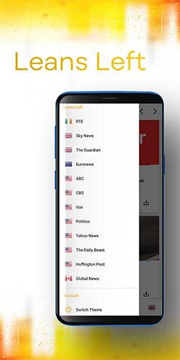

# News-Aggregation - Android

Final Year Project - Kotlin Android Application

SETU Software Systems Development 4

---

[Download From the Play Store](https://play.google.com/store/apps/details?id=org.ben.news&hl=en&gl=US)

[The React Web Version](https://github.com/BenCapper/news-web)

---

This news aggregator displays articles from many of the major western news outlets; both the left and right, allowing you to view both sides of the news.

Articles are displayed on a daily basis with menu options available allowing you to navigate backward or forward through the calendar to view a particular days news. Every list operates this way.

---

**Features**:

**Shuffle**:
Articles can be shuffled to shake up the order and view any news you might have missed.

**Filter**:
Every list has a filter function, allowing you to search for outlets or articles of your choice.

**See Both Sides**:
When we find two articles about the same topic and one leans left, while one leans right, we join and display them together in this section to allow you to come to the most informed conclusion possible.

**Share**:
Each article card contains a share button, allowing you to share news articles with friends and family.

**Saved**:
Each article card contains a save article button, allowing you to conveniently save noteworthy articles for later use. These can be removed by sliding the article to the left.

**View History**:
Each article you visit is saved to your history automatically and can be removed by sliding the article to the left.

**View by Outlet**:
Every outlet we get news from has their own option in the Navigation Drawer (Opened by the Hamburger Button in the Toolbar). Selecting any of these options will provide all news from that outlet, displayed on a day by day basis. Outlet options in the Navigation Drawer are categorized by the general political bias of that outlet, although this is a general leaning and not a rule. Some outlets are also news aggregators and often use news sources from "the other side of the aisle".

---

  

  
